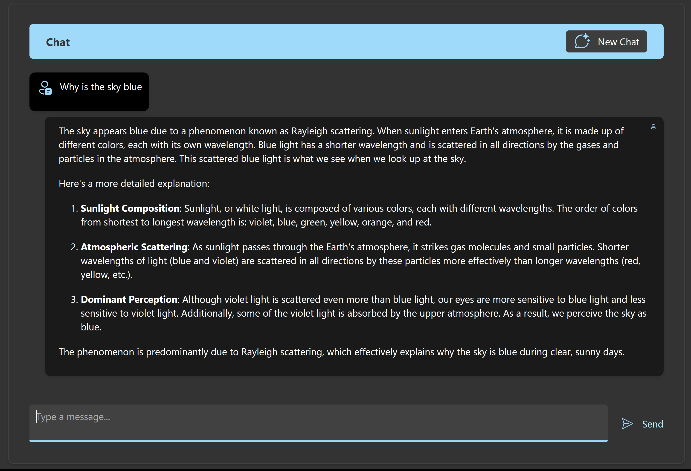

### [< Previous Challenge](./Challenge-01.md) - **[Home](../README.md)** - [Next Challenge >](./Challenge-03.md)

# Challenge-02 - Semantic Kernel Fundamentals

## Introduction

The first step in understanding Semantic Kernel is to become familiar with the basics. Semantic Kernel is a lightweight, open-source development kit designed to help developers build AI-infused applications using the latest AI models. It supports languages like C#, Python, and Java, making it versatile for various development environments. Semantic Kernel provides a simple and consistent API for developers to interact with several different AI models, including GPT-3.5, GPT-4, Meta-Llama, DALL·E, and many more. You can use Semantic Kernel to build applications that can generate text, images, sound, and even code. Models can be hosted locally or in the cloud, and you can use the same API to interact with them.

## Description

In this challenge, you will be provided with a starter application that will require you to complete the implementation of the chat feature using Semantic Kernel and the Azure OpenAI GPT-4o model. The application is a simple Blazor chat window that allows users to interact with the AI model by typing a question or prompt and pressing the **CTRL + Enter** key. The AI model will then respond with an answer or completion to the prompt. The application uses the Semantic Kernel framework to interact with the AI model. You will need to complete the implementation of the chat API to send the user's prompt to the AI model and return the response to the user.

## Prerequisites

1. Setting up the App Registration in Entra following these instructions, [Entra App Registration](./Resources/Supporting%20Challenges/Challenge-02-Entra.md).
1. Complete the [Getting Familiar With the Reference Application](./Resources/Supporting%20Challenges/Challenge-02-Reference-App.md) beginner guide.

## Challenges

1. Deploy a GTP-4o model using  [Azure Open AI Studio](https://oai.azure.com) `https://oai.azure.com`. The **Deployment name** should be something similar to ``` gpt-4o ```. This name will be needed next when configuring Semantic Kernel. :exclamation: Deployment type should be **Standard**. :exclamation:

1. Update the *appsettings.json* file with the Azure OpenAI *Deployment name*, *Endpoint URL* and the *API Key*. These values can be found in the Azure OpenAI Studio.

    :bulb: The endpoint URL should be in the format ```https://<deployment-name>.openai.azure.com```

    **appsettings.json**

    ```json
    "AOI_DEPLOYMODEL": "Replace with your AOI deployment name",
    "AOI_ENDPOINT": "Replace with your AOI endpoint",
    "AOI_API_KEY": "Replace with your AOI API key",
    ```

1. Navigate to the `Chat.razor.cs` and Implement the following code to add the Azure OpenAI Chat Completion service to the Kernel object.

    ```csharp
    //Add Azure OpenAI Chat Completion
    kernelBuilder.AddAzureOpenAIChatCompletion(
        Configuration["AOI_DEPLOYMODEL"],
        Configuration["AOI_ENDPOINT"]!,
        Configuration["AOI_API_KEY"]!);
    ```

    The **AddAzureOpenAIChatCompletion** method takes three parameters: the deployment model name, the endpoint URL, and the API key. These values are read from the *appsettings.json* file. Next, some additional services are added and logging is configured. Finally, the **Kernel** object is built and the application is started.

1. Locate the code comment ``` // Challenge 02 - Chat Completion Service ``` in the `Chat.razor.cs` file. This is where you will retrieve the chat completion service.


    :bulb: [Retrieving chat completion services](https://learn.microsoft.com/en-us/semantic-kernel/concepts/ai-services/chat-completion/?tabs=csharp-AzureOpenAI%2Cpython-AzureOpenAI%2Cjava-AzureOpenAI&pivots=programming-language-csharp#retrieving-chat-completion-services)

1. Implement the `SendMessage` Method.

    ```csharp
    private async Task SendMessage()
    {
        if (!string.IsNullOrWhiteSpace(newMessage) && chatHistory != null)
        {
            StateHasChanged();
            loading = true;

            // Start Challenge 02 - Sending a message to the chat completion service

            // Your code goes here

    ```

    1. Add the **user's message** to the chat history collection.

        In the `Chat.razor.cs` file, find the `SendMessage` method. Below the comment `// Start Challenge 02 - Sending a message to the chat completion service`, add the user's prompt from the `ChatRequest` object to the chat history collection.

        :bulb:For a detailed explanation of Chat History, please refer to the documentation [here](https://learn.microsoft.com/en-us/semantic-kernel/concepts/ai-services/chat-completion/chat-history?pivots=programming-language-csharp).

    1. Use the Chat Completion service to complete the implementation of the `SendMessage` method by sending the entire chat history, including the latest prompt, to the Azure OpenAI chat service. Once the service processes this and generates a response, wait until the full response is received before sending it back to the client.

        :bulb:Refer to the Semantic Kernel documentation [here](https://learn.microsoft.com/en-us/semantic-kernel/concepts/ai-services/chat-completion/?tabs=csharp-AzureOpenAI%2Cpython-AzureOpenAI%2Cjava-AzureOpenAI&pivots=programming-language-csharp#using-chat-completion-services) for an example of how to call the chat completion service.

    1. Now add the **AI's Response** *Content* to the Chat History collection.

        Once you have the response back from the chat service, you'll need to add the text of this response to the UI so your user can see it. We've already wired up the UI to read the data from the Chat History object that you've added the **user's message** to above. We can add the AI's response to this same collection as an **Assistant** message to ensure the user knows the message came from the AI. 
        
        :bulb: To see how the ChatHistory object works in detail, see the documentation [here](https://learn.microsoft.com/en-us/semantic-kernel/concepts/ai-services/chat-completion/chat-history?pivots=programming-language-csharp#creating-a-chat-history-object)

2. Run the application and test the chat completion by submitting the prompt ```Why is the sky blue```. The response should be similar to the following

    

    :bulb:For more information on the Semantic Kernel, refer to the documentation [here](https://learn.microsoft.com/en-us/semantic-kernel/concepts/kernel?pivots=programming-language-csharp).

3. Test the Chat History by submitting the following prompt without refreshing the browsing window and clearing the chat history.

    ```Why is it red```

    If the chat history is working, the AI will understand the context of the question to be ```Why is the sky red``` and provide a relevant response.

    :bulb:For more information on Chat History, refer to the documentation [here](https://learn.microsoft.com/en-us/semantic-kernel/concepts/ai-services/chat-completion/chat-history?pivots=programming-language-csharp).

4. Test the application with different prompts to ensure that it can respond to a variety of questions.

## Success Criteria

1. Verify that you deployed a Standard GPT-4o
1. Updated *appsettings.json* file with the correct values for Azure OpenAI GPT-4o model
1. The application runs and responds to users questions
1. The chat history is working as expected

## Learning Resources

[Understanding the kernel](https://learn.microsoft.com/en-us/semantic-kernel/concepts/kernel?pivots=programming-language-csharp)

[Chat completion](https://learn.microsoft.com/en-us/semantic-kernel/concepts/ai-services/chat-completion/?tabs=csharp-AzureOpenAI%2Cpython-AzureOpenAI%2Cjava-AzureOpenAI&pivots=programming-language-csharp)

[Chat history](https://learn.microsoft.com/en-us/semantic-kernel/concepts/ai-services/chat-completion/chat-history?pivots=programming-language-csharp)

[What is a Planner?](https://learn.microsoft.com/en-us/semantic-kernel/concepts/planning?pivots=programming-language-csharp)

### [< Previous Challenge](./Challenge-01.md) - **[Home](../README.md)** - [Next Challenge >](./Challenge-03.md)
